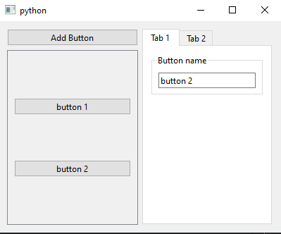

# PySide_UILoader
PySide6 dynamic ui loader similar to `uic.loadUi` from PyQt. This approach allows you make subclasses from UI widget without creating extra attribute.

# Installation

```sh
uv add git+https://github.com/CrinitusFeles/PySide_UILoader
```
or
```sh
pip install git+https://github.com/CrinitusFeles/PySide_UILoader
```

# Using

You can use `loadUi` function like in PyQt with automatic slot connection by name.

Example from `pyside_uiloader/example/mywidget.py`

```python
from pathlib import Path
from PySide6 import QtWidgets
from PySide6.QtCore import Slot
from pyside_uiloader import loadUi


class MyWidget(QtWidgets.QWidget):
    button_name_line_edit: QtWidgets.QLineEdit
    add_button: QtWidgets.QPushButton
    container_layout: QtWidgets.QVBoxLayout
    def __init__(self) -> None:
        super().__init__()
        loadUi(Path(__file__).parent / 'mywidget.ui', self)

    @Slot()
    def on_add_button_pressed(self) -> None:
        button_name: str = self.button_name_line_edit.text()
        new_button = QtWidgets.QPushButton(button_name)
        msg: str = f'button {button_name} pressed'
        new_button.pressed.connect(lambda: print(msg))
        self.container_layout.addWidget(new_button)


if __name__ == '__main__':
    app = QtWidgets.QApplication([])
    w = MyWidget()
    w.show()
    app.exec()

```

